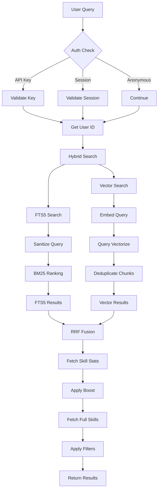

# Hybrid Search Architecture

## Overview
The hybrid search engine combines FTS5 keyword search with Vectorize semantic search using Reciprocal Rank Fusion (RRF) and quality boost scoring.

## Data Flow Diagram



## Component Architecture

```
┌─────────────────────────────────────────────────────────────┐
│                      API Endpoint Layer                      │
│  /api/search (POST) + ?q= loader (GET)                      │
│  - Dual auth (API key + session)                            │
│  - Request validation                                        │
│  - Error handling                                            │
└──────────────────┬──────────────────────────────────────────┘
                   │
                   ▼
┌─────────────────────────────────────────────────────────────┐
│                   Hybrid Search Orchestrator                 │
│  apps/web/app/lib/search/hybrid-search.ts                   │
│  - Parallel execution coordinator                            │
│  - Stats fetching                                            │
│  - Filter application                                        │
└──────┬──────────────────────────┬───────────────────────────┘
       │                          │
       ▼                          ▼
┌─────────────────┐        ┌─────────────────┐
│  FTS5 Search    │        │  Vector Search  │
│  (Keyword)      │        │  (Semantic)     │
│  - BM25 ranking │        │  - Embeddings   │
│  - SQL FTS5     │        │  - Vectorize    │
│  - Sanitization │        │  - Deduplication│
└────────┬────────┘        └────────┬────────┘
         │                          │
         └──────────┬───────────────┘
                    ▼
         ┌──────────────────────┐
         │    RRF Fusion        │
         │  - K=60 constant     │
         │  - Rank combination  │
         │  - Score calculation │
         └──────────┬───────────┘
                    ▼
         ┌──────────────────────┐
         │   Boost Scoring      │
         │  - RRF: 60%          │
         │  - Rating: 20%       │
         │  - Usage: 10%        │
         │  - Favorite: 10%     │
         └──────────┬───────────┘
                    ▼
         ┌──────────────────────┐
         │   Final Results      │
         │  - Full skill data   │
         │  - Scoring metadata  │
         │  - Filtered results  │
         └──────────────────────┘
```

## Search Scoring Formula

### RRF (Reciprocal Rank Fusion)
```
RRF_score = Σ (1 / (K + rank_i))
where K = 60, i ∈ {semantic, keyword}
```

### Quality Boost
```
final_score = (normalized_rrf × 0.6) +
              (normalized_rating × 0.2) +
              (normalized_usage × 0.1) +
              (is_favorited × 0.1)
```

## Error Handling Flow

```
┌──────────────┐
│ Hybrid Search│
└──────┬───────┘
       │
       ├─ Try: FTS5 + Vectorize
       │        │
       │        └─ Success → RRF Fusion
       │
       ├─ Catch: Vectorize Error
       │        │
       │        └─ Fallback: FTS5-only
       │
       └─ Catch: All Errors
                │
                └─ Return: Empty + Error Log
```

## Authentication Flow

```
┌─────────────────┐
│ Request Headers │
└────────┬────────┘
         │
         ├─ Authorization: Bearer sx_xxx?
         │        │
         │        ├─ Yes → Hash key
         │        │        │
         │        │        └─ Lookup in DB
         │        │                 │
         │        │                 ├─ Valid → User ID
         │        │                 └─ Invalid → Continue
         │        │
         │        └─ No → Check session
         │
         └─ Session cookie?
                  │
                  ├─ Yes → Validate
                  │        │
                  │        ├─ Valid → User ID
                  │        └─ Invalid → Anonymous
                  │
                  └─ No → Anonymous (null)
```

## Database Queries

### FTS5 Query
```sql
SELECT s.id as skill_id, bm25(skills_fts) as bm25_score
FROM skills_fts
JOIN skills s ON skills_fts.rowid = s.rowid
WHERE skills_fts MATCH ?
ORDER BY bm25(skills_fts)
LIMIT ?
```

### Vectorize Query
```javascript
const results = await vectorize.query(queryVector, {
  topK: limit * 3,  // Over-fetch for deduplication
  returnMetadata: true
});
```

### Stats Query
```javascript
// Parallel fetch of:
// 1. Skills (avg_rating, install_count)
// 2. Favorites (user-specific)
const [skillStats, userFavorites] = await Promise.all([...]);
```

## Performance Characteristics

| Operation | Time Complexity | Notes |
|-----------|----------------|-------|
| FTS5 Search | O(log n) | Indexed BM25 |
| Vector Search | O(n) | ANN approximate |
| RRF Fusion | O(m log m) | m = unique results |
| Boost Scoring | O(m) | Linear scan |
| Stats Fetch | O(k) | k = result count |

## Key Features

✅ **Parallel Execution**: FTS5 + Vectorize run simultaneously
✅ **Graceful Degradation**: Falls back to FTS5 if Vectorize fails
✅ **Deduplication**: Handles chunked skills (max score per skill_id)
✅ **Personalization**: User favorites boost (when authenticated)
✅ **Filter Support**: Category and is_paid filtering
✅ **Anonymous Access**: Search works without authentication
✅ **Dual Auth**: API key OR session authentication
✅ **Query Sanitization**: Prevents FTS5 injection attacks

## Limitations

⚠️ **No Caching**: Every query hits DB and Vectorize
⚠️ **No Pagination**: Returns top N results only
⚠️ **Static Weights**: Boost formula weights are hardcoded
⚠️ **No Analytics**: Query tracking not implemented
⚠️ **No A/B Testing**: Single fusion strategy

## Future Enhancements

1. **Redis Caching**: Cache popular queries for 5-10 minutes
2. **Cursor Pagination**: Efficient pagination for large result sets
3. **Dynamic Weights**: Learn optimal boost weights from usage
4. **Query Analytics**: Track search terms, CTR, conversion
5. **Autocomplete**: Real-time suggestions from popular queries
6. **Typo Tolerance**: Fuzzy matching and spelling correction
7. **Query Expansion**: Synonym expansion and related terms
8. **Personalized Ranking**: User history-based reranking
