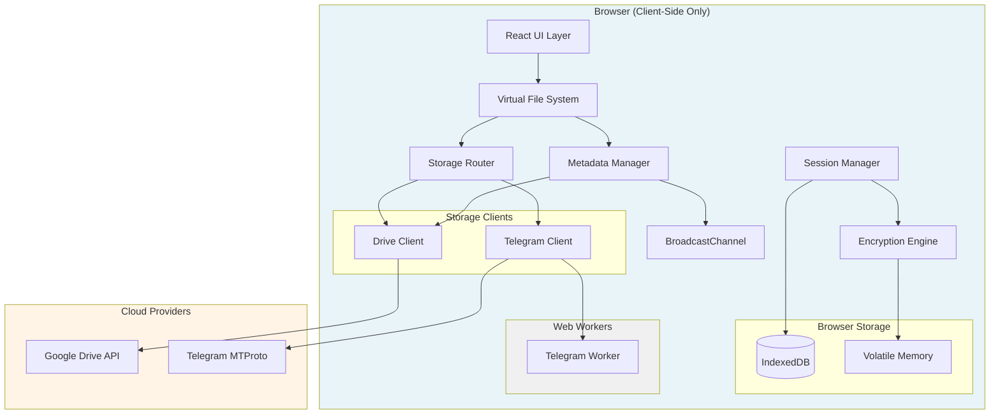
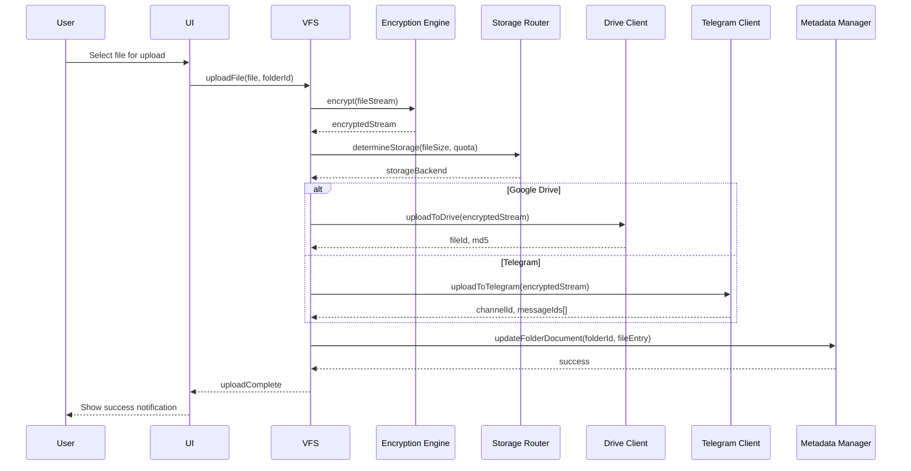

# Design Document — Lukman Cloud

## Overview

Lukman Cloud is a browser-based encrypted multi-cloud storage aggregator that unifies Google Drive (15GB) and Telegram Channel Storage (unlimited) under a single Virtual File System. The application is entirely client-side, running as a static site on Vercel Free Tier with no server-side processing. All cryptographic operations, file chunking, metadata management, and cloud provider communication occur directly in the browser using Web APIs.

### Core Design Principles

1. **Zero-Server Architecture**: All file operations happen client-to-cloud. No proxy servers, no timeout constraints, no payload limits
2. **Master Password Security**: Single password derives all encryption keys via PBKDF2. Keys stored only in volatile memory
3. **Metadata-as-Files**: Directory structure stored as JSON files in Google Drive's hidden appDataFolder using optimistic locking
4. **Smart Storage Routing**: Files <20MB go to Google Drive; larger files or quota exhaustion routes to Telegram
5. **Multi-Chunk Engine**: Files >2GB split into 2GB chunks for Telegram storage with SHA-256 verification
6. **Multi-Tab Coordination**: BroadcastChannel with leader election ensures metadata consistency across tabs
7. **Streaming Architecture**: Large files processed as streams to avoid memory exhaustion

### Technology Stack

- **Frontend Framework**: React 19 with TypeScript (strict mode)
- **Build Tool**: Vite
- **Styling**: Tailwind CSS v4 with Neobrutalism design tokens
- **Cryptography**: Web Crypto API (SubtleCrypto)
- **Storage**: IndexedDB for encrypted credentials
- **Google Drive**: OAuth 2.0 PKCE + Drive API v3
- **Telegram**: GramJS (MTProto WebSocket client)
- **Multi-Threading**: Web Workers for Telegram operations
- **Multi-Tab**: BroadcastChannel API
- **Hosting**: Vercel Free Tier (static site)

## Architecture

### System Architecture



### Component Architecture

The application follows a layered architecture with clear separation of concerns:

1. **Presentation Layer** (React UI): User interface, vault lock UI, file browser, upload/download progress
2. **Business Logic Layer** (VFS, Session Manager, Storage Router): File operations, security, routing decisions
3. **Security Layer** (Encryption Engine): All cryptographic operations, key derivation, encryption/decryption
4. **Metadata Layer** (Metadata Manager): Directory structure, FolderDocuments, optimistic locking
5. **Integration Layer** (Drive Client, Telegram Client): Cloud provider APIs, authentication, file transfer
6. **Storage Layer** (IndexedDB, Volatile Memory): Encrypted credentials, in-memory keys

### Data Flow: File Upload



## Components and Interfaces

### 1. Session Manager

**Responsibility**: Manages vault lock/unlock state, idle timeout, and encryption key lifecycle.

**State**:
```typescript
interface SessionState {
  isUnlocked: boolean;
  encryptionKey: CryptoKey | null; // Stored in closure, never exposed
  idleTimeoutHandle: number | null;
  unlockTimestamp: number | null;
}
```

**Public Interface**:
```typescript
interface SessionManager {
  // Initialize session manager
  initialize(): Promise<void>;
  
  // Create new vault with master password
  createVault(masterPassword: string): Promise<void>;
  
  // Unlock vault with master password
  unlock(masterPassword: string): Promise<void>;
  
  // Lock vault and clear encryption key
  lock(): void;
  
  // Check if vault is unlocked
  isUnlocked(): boolean;
  
  // Reset idle timeout (called on user interaction)
  resetIdleTimeout(): void;
  
  // Get encryption key (for internal use only)
  getEncryptionKey(): CryptoKey | null;
}
```

**Key Design Decisions**:
- Encryption key stored in closure scope, never serialized
- Idle timeout configured at 30 minutes (default, user-configurable)
- All user interactions (mouse, keyboard, touch) reset timeout
- Lock immediately clears key and notifies all components

### 2. Encryption Engine

**Responsibility**: All cryptographic operations using Web Crypto API.

**Algorithms**:
- Key Derivation: PBKDF2 with SHA-256, 600,000 iterations
- Encryption: AES-256-GCM with 96-bit IV
- Hashing: SHA-256 for chunk integrity

**Public Interface**:
```typescript
interface EncryptionEngine {
  // Generate new security parameters
  generateSecurityParams(): Promise<SecurityParams>;
  
  // Derive encryption key from master password
  deriveKey(masterPassword: string, salt: Uint8Array, iterations: number): Promise<CryptoKey>;
  
  // Encrypt data (credentials, files)
  encrypt(data: Uint8Array, key: CryptoKey): Promise<EncryptedData>;
  
  // Decrypt data
  decrypt(encryptedData: EncryptedData, key: CryptoKey): Promise<Uint8Array>;
  
  // Encrypt stream (for large files)
  encryptStream(readable: ReadableStream, key: CryptoKey): ReadableStream;
  
  // Decrypt stream (for large files)
  decryptStream(readable: ReadableStream, key: CryptoKey): ReadableStream;
  
  // Hash data (SHA-256)
  hash(data: Uint8Array): Promise<Uint8Array>;
}

interface SecurityParams {
  salt: Uint8Array; // 32 bytes (256-bit) — LOCKED: Phase 0 SEC-04
  iterations: number; // 600,000 — OWASP 2023 minimum
}

// PHASE 0 SECURITY CONSTRAINT SEC-01 (NON-NEGOTIABLE):
// ALL CryptoKey objects derived via SubtleCrypto MUST use `extractable: false`.
// This prevents the key material from ever leaving the SubtleCrypto boundary.
// The derivedKey held in the SessionManager closure MUST be created with:
//   extractable: false, keyUsages: ['encrypt', 'decrypt']

interface EncryptedData {
  iv: Uint8Array; // 12 bytes for GCM
  ciphertext: Uint8Array;
}
```

**Key Design Decisions**:
- 600,000 PBKDF2 iterations balances security and performance (~500ms on modern hardware)
- AES-GCM provides authenticated encryption (AEAD), detecting tampering
- Unique IV generated for every encryption operation using crypto.getRandomValues()
- IV prepended to ciphertext for storage/transmission
- Stream encryption processes data in 64KB chunks to avoid memory exhaustion

### 3. Metadata Manager

**Responsibility**: Manages directory structure as JSON files in Google Drive appDataFolder.

**Data Structures**:
```typescript
// PHASE 0 LOCK-IN: Directory-split metadata schema (AD-02).
// Each folder is stored as folder_{uuid}.json in Google Drive appDataFolder.
// The root folder uses the fixed ID 'root' (filename: folder_root.json).
// Navigation loads EXACTLY ONE folder document at a time — never the full tree.

type VFSEntryType = 'file' | 'folder';

// Discriminated union — replaces the former split children[]+subfolders[] design.
// ALL direct children (files AND subfolders) are stored in a single `entries` array.
type VFSEntry = VFSFile | VFSFolder;

interface VFSEntryBase {
  id: string;          // UUID v4 — globally unique across all entries
  type: VFSEntryType;
  name: string;
  createdAt: string;   // ISO 8601 UTC
  modifiedAt: string;  // ISO 8601 UTC
  starred: boolean;
}

interface VFSFile extends VFSEntryBase {
  type: 'file';
  mimeType: string;
  size: number;        // TOTAL original file size in bytes (not per-chunk)
  uploadStatus: 'pending' | 'complete' | 'failed';
  ref: GoogleDriveRef | TelegramRef; // Provider storage reference
}

interface VFSFolder extends VFSEntryBase {
  type: 'folder';
  folderId: string;             // UUID matching filename folder_{folderId}.json
  folderDocumentDriveId: string; // Google Drive file ID of the folder_<uuid>.json document
}

interface FolderDocument {
  schemaVersion: 1;
  folderId: string | 'root'; // 'root' for root document; UUID v4 for all others
  parentFolderId: string | null; // null ONLY for folderId === 'root'
  folderName: string;
  createdAt: string;   // ISO 8601 UTC
  modifiedAt: string;  // ISO 8601 UTC
  etag: string;        // Google Drive ETag — MUST be updated after every write
  selfDriveId: string; // Drive file ID of THIS folder document (for PATCH/DELETE)
  entries: VFSEntry[]; // All direct children (files AND subfolders)
}

interface GoogleDriveRef {
  provider: 'google_drive'; // LOCKED discriminant — NOT 'gdrive'
  driveFileId: string;      // Google Drive file ID
  mimeType: string;
  md5Checksum?: string;     // MD5 from Drive API for integrity verification
}

interface TelegramRef {
  provider: 'telegram'; // LOCKED discriminant
  channelId: string;    // Numeric channel ID (e.g. '-1001234567890')
  originalFilename: string;
  // SHA-256 of the COMPLETE reassembled file — computed BEFORE chunking.
  // Verified AFTER full reassembly on download.
  sha256Hash: string | null;
  totalParts: number;   // MUST equal chunks.length — INV-01
  chunks: TelegramChunk[];
}

interface TelegramChunk {
  partIndex: number;  // 0-based, sequential — INV-02: chunks[i].partIndex === i
  messageId: number;  // Telegram message ID of this chunk
  chunkSize: number;  // Byte size of this specific chunk
}
```

**Public Interface**:
```typescript
interface MetadataManager {
  // Initialize root folder
  initializeRoot(): Promise<void>;
  
  // Get folder by ID
  getFolder(folderId: string): Promise<FolderDocument>;
  
  // List folder contents
  listFolder(folderId: string): Promise<FolderDocument>;
  
  // Create new folder
  createFolder(parentId: string, name: string): Promise<FolderDocument>;
  
  // Rename folder or file
  rename(itemId: string, newName: string, isFolder: boolean): Promise<void>;
  
  // Move file or folder
  move(itemId: string, newParentId: string, isFolder: boolean): Promise<void>;
  
  // Delete file or folder (recursive for folders)
  delete(itemId: string, isFolder: boolean): Promise<void>;
  
  // Add file entry to folder
  addFile(folderId: string, fileEntry: FileEntry): Promise<void>;
  
  // Search files by name
  searchFiles(query: string): Promise<FileSearchResult[]>;
  
  // Validate metadata integrity
  validateIntegrity(): Promise<ValidationResult>;
}

interface FileSearchResult {
  file: FileEntry;
  folderPath: string[];
}
```

**Key Design Decisions**:
- Each folder is a separate JSON file: `folder_<uuid>.json`
- Stored in Google Drive appDataFolder (hidden from user, app-specific)
- ETag-based optimistic locking prevents concurrent write conflicts
- On ETag mismatch: fetch latest, merge changes, retry (max 3 attempts)
- BroadcastChannel leader election serializes writes across tabs
- Folder operations update only affected FolderDocuments (not entire tree)
- File deletion removes metadata but defers cloud file deletion to garbage collection

### 4. Storage Router

**Responsibility**: Determines optimal storage backend for each file.

**Routing Logic**:
```typescript
interface StorageRouter {
  // Determine storage backend for file
  determineStorage(fileSize: number): Promise<StorageBackend>;
  
  // Get current Google Drive quota
  getQuota(): Promise<QuotaInfo>;
  
  // Force storage backend (user override)
  forceStorage(backend: StorageBackend): void;
  
  // Reset forced storage to automatic
  resetToAutomatic(): void;
}

type StorageBackend = 'gdrive' | 'telegram';

interface QuotaInfo {
  total: number;
  used: number;
  available: number;
  safetyBuffer: number; // 500MB default
}
```

**Routing Algorithm**:
```
function determineStorage(fileSize: number): StorageBackend {
  if (forcedBackend !== null) {
    return forcedBackend;
  }
  
  const quota = await getQuota();
  const remainingAfterUpload = quota.available - fileSize;
  
  if (fileSize >= SIZE_THRESHOLD) {
    // Large file (>=20MB): prefer Telegram
    return 'telegram';
  }
  
  if (remainingAfterUpload < quota.safetyBuffer) {
    // Would breach safety buffer: use Telegram
    return 'telegram';
  }
  
  // Small file with sufficient quota: use Google Drive
  return 'gdrive';
}

// Constants (user-configurable)
const SIZE_THRESHOLD = 20 * 1024 * 1024; // 20MB
const SAFETY_BUFFER = 500 * 1024 * 1024; // 500MB
```

**Key Design Decisions**:
- Default threshold: 20MB (configurable)
- Safety buffer: 500MB (prevents quota exhaustion)
- Telegram preferred for large files (unlimited storage)
- Google Drive preferred for small files (faster access, native integration)
- User can override routing per-file or globally
- Quota checked before each upload decision

### 5. Drive Client

**Responsibility**: Google Drive API integration with OAuth 2.0 PKCE.

**Public Interface**:
```typescript
interface DriveClient {
  // Initialize OAuth PKCE flow
  authenticate(): Promise<void>;
  
  // Check if authenticated
  isAuthenticated(): boolean;
  
  // Refresh access token
  refreshToken(): Promise<void>;
  
  // Upload file to Drive
  uploadFile(stream: ReadableStream, filename: string): Promise<DriveFileRef>;
  
  // Download file from Drive
  downloadFile(fileId: string): Promise<ReadableStream>;
  
  // Verify file integrity
  verifyChecksum(fileId: string, expectedMd5: string): Promise<boolean>;
  
  // Get quota information
  getQuota(): Promise<QuotaInfo>;
  
  // Upload metadata file to appDataFolder
  uploadMetadata(folderId: string, doc: FolderDocument, etag?: string): Promise<string>;
  
  // Download metadata file from appDataFolder
  downloadMetadata(folderId: string): Promise<{ doc: FolderDocument; etag: string }>;
  
  // Delete file from Drive
  deleteFile(fileId: string): Promise<void>;
}

interface DriveFileRef {
  fileId: string;
  md5: string;
}
```

**OAuth 2.0 PKCE Flow**:
```
1. Generate code_verifier (43-128 characters, cryptographically random)
2. Compute code_challenge = base64url(sha256(code_verifier))
3. Redirect to Google OAuth with:
   - client_id (public, from environment)
   - redirect_uri (Vercel deployment URL)
   - scope: "https://www.googleapis.com/auth/drive.appdata https://www.googleapis.com/auth/drive.file"
   - code_challenge
   - code_challenge_method: "S256"
   - access_type: "offline" (for refresh token)
4. User authorizes, redirected back with authorization code
5. Exchange code for tokens with code_verifier
6. Encrypt and store access_token, refresh_token in IndexedDB
```

**Key Design Decisions**:
- PKCE eliminates need for client secret (fully client-side)
- Offline access scope provides refresh token
- appDataFolder scope for metadata (hidden from user)
- drive.file scope for user files (app-created files only)
- Streaming uploads using resumable upload protocol
- MD5 checksums computed during upload, verified on download
- ETag-based optimistic locking for metadata files
- Token refresh automatic on 401 responses

### 6. Telegram Client

**Responsibility**: Telegram MTProto integration with multi-chunking engine.

**Public Interface**:
```typescript
interface TelegramClient {
  // Initialize GramJS client
  initialize(): Promise<void>;
  
  // Authenticate with phone or bot token
  authenticate(method: 'phone' | 'bot', credentials: string): Promise<void>;
  
  // Check if authenticated
  isAuthenticated(): boolean;
  
  // Set target channel for storage
  setStorageChannel(channelId: string): Promise<void>;
  
  // Upload file to Telegram (with chunking for >2GB)
  uploadFile(stream: ReadableStream, filename: string): Promise<TelegramFileRef>;
  
  // Download file from Telegram (reassemble chunks)
  downloadFile(ref: TelegramRef): Promise<ReadableStream>;
  
  // Delete message(s) from channel
  deleteMessages(channelId: string, messageIds: string[]): Promise<void>;
  
  // Get channel info
  getChannelInfo(channelId: string): Promise<ChannelInfo>;
}

interface TelegramFileRef {
  channelId: string;
  chunks: ChunkReference[];
}

interface ChannelInfo {
  id: string;
  title: string;
  isChannel: boolean;
}
```

**Multi-Chunking Engine (Web Worker)**:
```typescript
// Main thread interface
interface TelegramWorkerAPI {
  chunkAndUpload(file: File, channelId: string): Promise<ChunkReference[]>;
  downloadAndReassemble(chunks: ChunkReference[], channelId: string): Promise<Blob>;
}

// Worker implementation
const CHUNK_SIZE = 2 * 1024 * 1024 * 1024; // 2GB

async function chunkAndUpload(file: File, channelId: string): ChunkReference[] {
  const chunks: ChunkReference[] = [];
  let offset = 0;
  let index = 0;
  
  while (offset < file.size) {
    const chunkSize = Math.min(CHUNK_SIZE, file.size - offset);
    const chunkBlob = file.slice(offset, offset + chunkSize);
    const chunkData = await chunkBlob.arrayBuffer();
    
    // Hash chunk
    const hash = await crypto.subtle.digest('SHA-256', chunkData);
    const sha256 = bufferToHex(hash);
    
    // Upload chunk as message
    const messageId = await uploadChunkToTelegram(chunkData, channelId);
    
    chunks.push({
      index,
      messageId,
      sha256,
      size: chunkSize
    });
    
    offset += chunkSize;
    index++;
  }
  
  return chunks;
}

async function downloadAndReassemble(chunks: ChunkReference[], channelId: string): Blob {
  const chunkBlobs: Blob[] = [];
  
  for (const chunk of chunks) {
    let attempts = 0;
    let verified = false;
    
    while (attempts < 3 && !verified) {
      const data = await downloadChunkFromTelegram(chunk.messageId, channelId);
      const hash = await crypto.subtle.digest('SHA-256', data);
      const sha256 = bufferToHex(hash);
      
      if (sha256 === chunk.sha256) {
        chunkBlobs.push(new Blob([data]));
        verified = true;
      } else {
        attempts++;
      }
    }
    
    if (!verified) {
      throw new Error(`Chunk ${chunk.index} integrity verification failed after 3 attempts`);
    }
  }
  
  return new Blob(chunkBlobs);
}
```

**Key Design Decisions**:
- GramJS library for MTProto over WebSocket
- All Telegram operations run in Web Worker (non-blocking)
- Files >2GB split into sequential 2GB chunks
- Each chunk uploaded as separate message to configured channel
- SHA-256 hash per chunk for integrity verification
- 3 retry attempts per chunk on hash mismatch
- Chunks downloaded and verified before reassembly
- Session data encrypted and persisted in IndexedDB
- Supports phone authentication with 2FA and bot token authentication

### 7. Virtual File System (VFS)

**Responsibility**: Presents unified file system interface, orchestrates components.

**Public Interface**:
```typescript
interface VirtualFileSystem {
  // Initialize VFS
  initialize(): Promise<void>;
  
  // Navigate to folder
  navigateToFolder(folderId: string): Promise<FolderDocument>;
  
  // Get current folder
  getCurrentFolder(): FolderDocument | null;
  
  // Upload file(s)
  uploadFiles(files: File[], folderId: string): Promise<UploadResult[]>;
  
  // Download file
  downloadFile(fileId: string): Promise<void>;
  
  // Create folder
  createFolder(name: string, parentId: string): Promise<FolderDocument>;
  
  // Rename item
  renameItem(itemId: string, newName: string, isFolder: boolean): Promise<void>;
  
  // Move item
  moveItem(itemId: string, newParentId: string, isFolder: boolean): Promise<void>;
  
  // Delete item
  deleteItem(itemId: string, isFolder: boolean): Promise<void>;
  
  // Search files
  searchFiles(query: string): Promise<FileSearchResult[]>;
  
  // Get breadcrumb path
  getBreadcrumbPath(folderId: string): Promise<FolderReference[]>;
}

interface UploadResult {
  filename: string;
  success: boolean;
  error?: string;
}
```

**Upload Pipeline**:
```
1. User selects files
2. VFS validates file names
3. For each file:
   a. Create ReadableStream from File
   b. Pass to EncryptionEngine.encryptStream()
   c. Query StorageRouter.determineStorage()
   d. Upload to determined backend (DriveClient or TelegramClient)
   e. Get storage reference (GoogleDriveRef or TelegramRef)
   f. Create FileEntry
   g. MetadataManager.addFile()
4. Broadcast metadata change to other tabs
5. Update UI with results
```

**Download Pipeline**:
```
1. User requests file download
2. VFS gets FileEntry from MetadataManager
3. Determine backend from storageRef.type
4. Download from backend (DriveClient or TelegramClient)
5. Get encrypted ReadableStream
6. Pass to EncryptionEngine.decryptStream()
7. Verify integrity (MD5 for Drive, SHA-256 for Telegram chunks)
8. Trigger browser download using Blob URL
9. Release memory
```

**Key Design Decisions**:
- VFS orchestrates all components, owns business logic
- Streaming architecture for large files
- Concurrent upload/download limit: 3 files
- Progress tracking via ReadableStream progress events
- Error handling with retry logic
- Breadcrumb navigation caching for performance

### 8. Multi-Tab Coordination

**Responsibility**: Ensure metadata consistency across browser tabs.

**BroadcastChannel Protocol**:
```typescript
type BroadcastMessage = 
  | { type: 'leader_election'; tabId: string; timestamp: number }
  | { type: 'leader_announce'; tabId: string }
  | { type: 'metadata_write_request'; tabId: string; operation: MetadataOperation }
  | { type: 'metadata_write_complete'; operation: MetadataOperation }
  | { type: 'metadata_changed'; folderId: string }
  | { type: 'vault_locked'; tabId: string };

interface MetadataOperation {
  type: 'add_file' | 'create_folder' | 'rename' | 'move' | 'delete';
  folderId: string;
  data: any;
}
```

**Leader Election Algorithm**:
```
1. Each tab broadcasts leader_election with tabId and timestamp on startup
2. Wait 100ms to collect responses
3. Tab with lowest timestamp becomes leader
4. Leader broadcasts leader_announce
5. If leader tab closes:
   a. Other tabs detect absence via heartbeat
   b. New leader election triggered
6. All metadata writes route through leader
```

**Write Serialization**:
```
Non-leader tab write flow:
1. Tab calls MetadataManager.addFile()
2. MetadataManager detects not leader
3. Sends metadata_write_request via BroadcastChannel
4. Returns Promise (waits for completion)
5. Leader receives request
6. Leader performs actual metadata write
7. Leader broadcasts metadata_write_complete
8. Original tab resolves Promise

Leader tab write flow:
1. Tab calls MetadataManager.addFile()
2. MetadataManager detects is leader
3. Performs write directly
4. Broadcasts metadata_write_complete
```

**Key Design Decisions**:
- BroadcastChannel for same-origin tab communication
- Leader election on startup and leader disconnection
- Heartbeat every 5 seconds to detect leader failure
- All writes serialized through leader (prevents conflicts)
- Non-leader tabs proxy writes to leader via BroadcastChannel
- Metadata change broadcasts trigger UI refresh in all tabs
- Vault lock in any tab broadcasts to lock all tabs

## Data Models

### IndexedDB Schema

**Database Name**: `aethervault_secure_vault` — LOCKED: Phase 0 specification (Section 2.2)

**Object Stores**:

1. **security_params** (keyPath: 'id')
```typescript
// PHASE 0 LOCK-IN: Salt stored as ArrayBuffer (NOT base64 string).
// IndexedDB natively supports ArrayBuffer storage — no encoding roundtrip needed.
// Encoding/decoding introduces unnecessary complexity and potential bugs.
interface SecurityParamsRecord {
  id: 'master_salt';    // Fixed key — single record per vault
  salt: ArrayBuffer;    // 32 bytes (256-bit) raw CSPRNG bytes — Phase 0 SEC-04
  createdAt: string;    // ISO 8601 UTC
}

interface VaultVersionRecord {
  id: 'vault_version';
  version: number;      // Schema version for migration support
  createdAt: string;
}
```

2. **encrypted_credentials** (keyPath: 'credentialKey')
```typescript
// PHASE 0 LOCK-IN: iv and ciphertext stored as ArrayBuffer (NOT base64 strings).
// ArrayBuffer storage in IndexedDB is binary-safe, more efficient, and avoids
// base64 encoding errors. The GCM authentication tag is appended automatically
// by SubtleCrypto to the ciphertext ArrayBuffer.
interface EncryptedCredentialRecord {
  credentialKey: 'telegram_session' | 'google_oauth_tokens' | 'app_config';
  iv: ArrayBuffer;          // 96-bit (12 bytes) — fresh random IV per encryption
  ciphertext: ArrayBuffer;  // AES-256-GCM output + 128-bit auth tag (appended by SubtleCrypto)
  encryptedAt: string;      // ISO 8601 UTC — for audit/debugging
}

// Decrypted credential structures (plaintext in memory ONLY, never persisted)
interface GoogleOAuthTokens {
  accessToken: string;
  refreshToken: string;
  expiresAt: number;   // Unix timestamp ms
}

interface TelegramSessionCredentials {
  // GramJS StringSession.save() output — base64-encoded session string.
  // NEVER stored in plaintext. Always encrypted before IndexedDB write.
  sessionString: string;
}

interface AppConfig {
  telegramChannelId: string;  // Numeric channel ID
  rootFolderDriveId: string;  // Drive file ID of folder_root.json
  sizeThresholdBytes: number; // Default: 20MB
  safetyBufferBytes: number;  // Default: 500MB
  idleTimeoutMinutes: number; // Default: 30
}
```

3. **settings** (keyPath: 'key')
```typescript
interface SettingsRecord {
  key: 'config';
  value: EncryptedSettings;
}

interface EncryptedSettings {
  iv: string;
  ciphertext: string; // Encrypted AppSettings
}

interface AppSettings {
  sizeThreshold: number; // 20MB default
  safetyBuffer: number; // 500MB default
  idleTimeout: number; // 30 minutes default
  telegramChannelId: string;
}
```

### Google Drive AppDataFolder Structure

```
appDataFolder/
  folder_<root-uuid>.json           # Root folder
  folder_<uuid-1>.json               # Subfolder 1
  folder_<uuid-2>.json               # Subfolder 2
  ...
```

Each file contains a `FolderDocument` JSON structure.

### File Storage Organization

**Google Drive** (Files created by app):
- User files stored with encrypted content
- Filename preserved (original name)
- MD5 checksum in file metadata

**Telegram** (Messages in configured channel):
- Each message contains one chunk (up to 2GB)
- Message caption: `chunk_<index>_<filename>`
- File uploaded as document attachment

## Multi-User Architecture & Data Isolation Proof

### Deployment Model

Lukman Cloud is deployed as a **public static site** on Vercel Free Tier. The URL is publicly accessible, but this is inherently safe because the application has zero server-side data storage. Vercel serves only static assets (HTML, JavaScript, CSS). **No user credentials, file metadata, or file content ever touches Vercel's servers.**

### Formal Isolation Proof

**Layer 1 — Origin-Isolated IndexedDB**

The browser's IndexedDB is strictly sandboxed by the Same-Origin Policy. When Lukman visits `https://lukman-cloud.vercel.app`, his vault data is stored in the IndexedDB partition for that exact origin. When another person visits the same URL on their own device:
- A separate, empty IndexedDB partition is created on *their* device
- They have zero visibility into Lukman's IndexedDB
- There is no mechanism for one visitor's browser to read another visitor's browser storage

**Layer 2 — Device-Physical Isolation**

IndexedDB is stored on the user's local filesystem. It is not transmitted to Vercel, to Google, or to Telegram. Two different physical devices always have completely separate IndexedDB instances, even when visiting the same URL.

**Layer 3 — AES-256-GCM Encryption at Rest**

Even if an attacker gained physical access to a device, IndexedDB contents are encrypted:
- All credentials (Google OAuth tokens, Telegram session strings) are AES-256-GCM encrypted
- The decryption `CryptoKey` (`extractable: false`) exists only in volatile browser memory
- The key is present only while the vault is explicitly unlocked with the correct Master Password
- On vault lock, tab close, or idle timeout: the key is nullified and garbage collected

**Threat Model Table**

| Threat Actor | Attack Vector | Can Access Data? | Reason |
|---|---|---|---|
| Public internet user | Visits the Vercel URL | ❌ | Their device has its own empty IndexedDB |
| Network attacker | Intercepts Vercel CDN | ❌ | Static assets only; no user data on server |
| Determined attacker | Reads Lukman's IndexedDB files | ❌ (without password) | AES-256-GCM encrypted; key only in volatile memory |
| Device thief | Steals Lukman's laptop | ❌ (without Master Password) | Vault locked; key not persisted to disk |
| Trusted family member | Visits URL on their own device | ✅ (their vault only) | BYOS model; independent vault per device |
| Trusted family member | Visits URL on Lukman's device | ❌ | Cannot unlock without Lukman's Master Password |

---

## Bring-Your-Own-Storage (BYOS) Multi-User Model

### Architecture Principle

Lukman Cloud is a **decentralized, per-user client engine**. There is no concept of a central "Lukman Cloud account" or shared user database. The Vercel deployment functions purely as a CDN for the client-side application code.

Each trusted user (family member, close friend, relative) operates a completely independent vault:

```
User A (Lukman)                      User B (Family Member)
─────────────────────────────        ──────────────────────────────────
Device: Lukman's PC                  Device: Family member's phone
IndexedDB: Vault A                   IndexedDB: Vault B
  Master Password: [Lukman's]          Master Password: [Member's own]
  Google Drive: Lukman's account       Google Drive: Member's account
  Telegram: Lukman's channel           Telegram: Member's channel
  Files: Lukman's files ONLY           Files: Member's files ONLY

Both visit: https://lukman-cloud.vercel.app
But their data is COMPLETELY SEPARATE.
```

### BYOS User Onboarding Flow

1. **Out-of-band invitation:** Lukman sends the app URL + `ACCESS_CODE` to a trusted person via secure messaging
2. **Device setup:** The invited user visits the URL on their own device
3. **Access gate:** User enters `ACCESS_CODE` to unlock vault creation
4. **Personal Master Password:** User creates their own password (never shared, never stored)
5. **Own Google authorization:** User authorizes their own Google account via PKCE OAuth
6. **Own Telegram account:** User connects their personal Telegram account via GramJS MTProto
7. **Independent vault:** Initialized — backed by the user's own cloud storage, completely isolated

### Storage Independence Guarantee

| Property | Guarantee |
|---|---|
| Lukman's files | Stored in Lukman's Google Drive + Lukman's Telegram |
| Family member's files | Stored in their own Google Drive + their own Telegram |
| Cross-user visibility | **Zero.** No shared storage backend. |
| Family member can see Lukman's files | ❌ Never |
| Lukman can see family member's files | ❌ Never |
| Central user database | ❌ Does not exist |

---

## Access Code Gate

### Purpose

The Access Code Gate is a **client-side friction layer** that prevents unintended vault initialization. It is NOT a cryptographic security boundary — it is a UX gate designed to:

1. Prevent unauthorized users from accidentally initializing vaults
2. Add first-pass deterrence against casual unauthorized access
3. Give Lukman control over onboarding without building a backend

### Mechanism

**Build-time configuration (`.env` / Vercel dashboard):**
```
VITE_APP_ACCESS_CODE=<lukman-chosen-secret>
```
Vite replaces `import.meta.env.VITE_APP_ACCESS_CODE` with the literal value at build time.

**Runtime flow:**
```
App loads
  ↓
Check IndexedDB: does security_params["master_salt"] exist?
  ├── YES → Returning user → SKIP gate → Show vault UNLOCK screen
  └── NO  → New device → Show ACCESS CODE prompt
                ↓
          User enters access code
                ├── Matches import.meta.env.VITE_APP_ACCESS_CODE?
                │     YES → Proceed to VaultSetup (Master Password creation)
                │     NO  → Error: "Invalid access code." HARD-BLOCK vault creation.
                └── No rate-limit (brute-force defense delegated to Google OAuth layer)
```

### Security Properties & Limitations

| Property | Value |
|---|---|
| Protection type | Convenience friction layer, NOT cryptographic |
| Extractable from bundle? | YES — by anyone with JavaScript dev tools |
| Protects against | Casual unauthorized users, accidental onboarding |
| Does NOT protect against | Motivated attackers who inspect the bundle |
| Primary security enforcer | Google OAuth Testing Mode (server-side) |
| Applies to | First-time vault initialization ONLY |
| Returning users affected? | NO — vault unlock screen shown directly |

---

## Google OAuth Testing Mode Guard

### Purpose

The Google OAuth Testing Mode Guard is the **primary security boundary** for Lukman Cloud. Unlike the client-side Access Code Gate, this operates entirely at **Google's infrastructure level** and cannot be bypassed by any client-side attack.

### Configuration

In Google Cloud Console:
```
APIs & Services → OAuth consent screen
  └── Publishing Status: TESTING  ← NEVER change to "In Production"
  └── Test users: [add authorized Gmail addresses here]
```

### Whitelist Enforcement Flow

```
User clicks "Connect Google Drive"
  ↓
App redirects to: accounts.google.com/oauth/authorize?...
  ↓
Google checks: Is this Gmail address in the Test Users list?
  ├── YES → OAuth consent shown → User authorizes → Access token returned to app ✅
  └── NO  → Google shows "Access Blocked" error
              App NEVER receives any token. Attack fails at Google's servers. ❌
```

### Why This Cannot Be Bypassed

- The whitelist check runs on **Google's servers**, not in the Lukman Cloud JS bundle
- An attacker who reverse-engineers the `VITE_APP_ACCESS_CODE` from the bundle still cannot complete OAuth
- An attacker who bypasses the client-side gate still cannot obtain a valid Google OAuth token
- Google enforces this for ALL OAuth clients in Testing mode — there is no client-side workaround

### Managing the Whitelist

| Action | How |
|---|---|
| Add a new family member | Google Cloud Console → OAuth consent screen → Add email to Test users |
| Revoke a user's future access | Remove email from Test users list |
| Emergency token revocation | Google Cloud Console → Security → Revoke all tokens |
| Maximum test users | 100 (sufficient for family/friends use case) |

> **Note:** Removing a user from the test list prevents token refresh. Their existing 1-hour access token eventually expires, after which they cannot re-authenticate.

### Combined Defense-in-Depth Security Architecture

```
STRANGER attempts to use Lukman Cloud:
                      ↓
┌──────────────────────────────────────────────────────────────┐
│ LAYER 1: Access Code Gate (Client-Side Friction)             │
│ Mechanism: VITE_APP_ACCESS_CODE env var embedded at build     │
│ Blocks: Casual/accidental unauthorized users                  │
│ Bypassed by: Motivated attackers (bundle inspection)          │
└──────────────────────────────────────────────────────────────┘
                      ↓
┌──────────────────────────────────────────────────────────────┐
│ LAYER 2: Google OAuth Testing Mode (Server-Side Hard Wall)   │
│ Mechanism: Google Cloud Console test user whitelist           │
│ Blocks: ALL users not pre-approved by Lukman                  │
│ Bypassed by: CANNOT BE BYPASSED — enforced by Google infra    │
└──────────────────────────────────────────────────────────────┘
                      ↓
┌──────────────────────────────────────────────────────────────┐
│ LAYER 3: IndexedDB AES-256-GCM Encryption (Device-Level)     │
│ Mechanism: Master Password + PBKDF2 + extractable:false key   │
│ Blocks: Physical device compromise without Master Password    │
│ Bypassed by: Correct Master Password only                     │
└──────────────────────────────────────────────────────────────┘

RESULT: Practically unbreakable for the family/friends threat model.
```

---

## Correctness Properties

*A property is a characteristic or behavior that should hold true across all valid executions of a system—essentially, a formal statement about what the system should do. Properties serve as the bridge between human-readable specifications and machine-verifiable correctness guarantees.*

Before writing correctness properties, I need to analyze each acceptance criterion to determine testability and identify universal properties suitable for property-based testing.


### Property 1: Credential Encryption Before Storage

*For any* credentials (OAuth tokens or Telegram session data), when stored in IndexedDB, the credentials SHALL be encrypted using AES-256-GCM with the Master_Password-derived key, and decryption SHALL successfully recover the original credentials.

**Validates: Requirements 1.2, 6.4, 8.3, 14.3**

### Property 2: Encryption IV Uniqueness

*For any* data encryption operation, the Encryption_Engine SHALL generate a unique initialization vector (IV) such that encrypting the same data multiple times produces different IVs, and the IV SHALL be recoverable from the ciphertext for decryption.

**Validates: Requirements 1.8, 9.2, 9.3**

### Property 3: Authentication Error Consistency

*For any* incorrect Master_Password, the Encryption_Engine SHALL return an authentication error without revealing whether credentials exist in IndexedDB, maintaining consistent behavior regardless of the incorrect password provided.

**Validates: Requirements 1.5**

### Property 4: Idle Timeout Reset

*For any* user interaction event (mouse, keyboard, touch), the Session_Manager SHALL reset the Idle_Timeout timer, ensuring continuous activity prevents automatic vault locking.

**Validates: Requirements 2.2**

### Property 5: Vault Lock Clears Credentials

*For any* vault lock operation (manual or timeout-triggered), the Session_Manager SHALL clear all decrypted credentials and the encryption key from volatile memory, preventing access until the vault is unlocked again.

**Validates: Requirements 2.4, 2.5, 8.5**

### Property 6: File Operations Require Unlock

*For any* file operation (upload, download, rename, move, delete) attempted while the vault is locked, the operation SHALL be blocked until the user successfully unlocks the vault with the correct Master_Password.

**Validates: Requirements 2.6**

### Property 7: FolderDocument Schema Completeness

*For any* FolderDocument created in the system, the document SHALL contain all required fields: id (UUID v4), name, parentId (null for root), createdAt, modifiedAt, children array, and subfolders array.

**Validates: Requirements 3.2**

### Property 8: Metadata Update Isolation

*For any* two distinct folders A and B, when a file is added to folder A, only folder A's FolderDocument SHALL be modified, and folder B's FolderDocument SHALL remain unchanged.

**Validates: Requirements 3.3, 10.7**

### Property 9: Storage Reference Completeness

*For any* file stored in the system, the storage reference SHALL contain all required fields for its type: GoogleDriveRef SHALL have fileId and md5; TelegramRef SHALL have channelId and non-empty chunks array where each chunk has messageId and sha256.

**Validates: Requirements 3.6, 3.7, 13.4, 13.5, 13.7**

### Property 10: Leader Election Uniqueness

*For any* number of open browser tabs running Lukman Cloud, exactly one tab SHALL be elected as BroadcastChannel_Leader at any point in time.

**Validates: Requirements 4.1**

### Property 11: Metadata Write Serialization

*For any* metadata write operation from a non-leader tab, the operation SHALL be routed through the BroadcastChannel_Leader, ensuring all writes are serialized to prevent conflicts.

**Validates: Requirements 4.2, 4.4**

### Property 12: Metadata Change Broadcast

*For any* metadata change (file added, folder created, item renamed, item moved, item deleted), all open tabs SHALL receive a change notification via BroadcastChannel, and each receiving tab SHALL refresh its local metadata view.

**Validates: Requirements 4.5, 4.6**

### Property 13: Small File Routing to Drive

*For any* file with size less than 20MB, when Google Drive available quota exceeds file size plus Safety_Buffer (500MB), the Storage_Router SHALL route the file to Google Drive.

**Validates: Requirements 5.1**

### Property 14: Large File Routing to Telegram

*For any* file with size greater than or equal to 20MB, the Storage_Router SHALL route the file to Telegram storage regardless of Google Drive quota availability.

**Validates: Requirements 5.3**

### Property 15: Quota-Based Routing to Telegram

*For any* file, when Google Drive available quota is less than file size plus Safety_Buffer, the Storage_Router SHALL route the file to Telegram storage.

**Validates: Requirements 5.2, 5.5**

### Property 16: Quota Check Before Routing

*For any* file upload, the Storage_Router SHALL query Google Drive quota information before making the storage backend routing decision.

**Validates: Requirements 5.4**

### Property 17: Manual Storage Override

*For any* storage backend selection (Google Drive or Telegram) manually forced by the user, the Storage_Router SHALL route files to the specified backend regardless of automatic routing logic.

**Validates: Requirements 5.6**

### Property 18: PKCE Verifier Uniqueness

*For any* OAuth 2.0 PKCE authorization flow initiated, the Drive_Client SHALL generate a unique code_verifier and corresponding code_challenge, such that multiple flows produce different values.

**Validates: Requirements 6.2**

### Property 19: Drive File Integrity Verification

*For any* file uploaded to Google Drive, the Drive_Client SHALL compute and store an MD5 checksum in GoogleDriveRef, and when downloading that file, SHALL verify the downloaded file's MD5 matches the stored value.

**Validates: Requirements 6.8, 6.9**

### Property 20: File Chunking for Large Telegram Uploads

*For any* file larger than 2GB uploaded to Telegram, the Telegram_Client SHALL split the file into sequential chunks where each chunk is at most 2GB, with chunk indices starting from 0 and incrementing sequentially.

**Validates: Requirements 7.3, 13.6**

### Property 21: Telegram Chunk Hash Verification

*For any* chunk uploaded to Telegram, the Telegram_Client SHALL compute and store a SHA-256 hash, and when downloading that chunk, SHALL verify the downloaded chunk's hash matches the stored value.

**Validates: Requirements 7.5, 7.8**

### Property 22: Telegram Chunk Upload Completeness

*For any* file uploaded to Telegram with N chunks, the Telegram_Client SHALL upload N separate messages to the configured channel, and the TelegramRef SHALL contain exactly N message IDs in sequential order.

**Validates: Requirements 7.4, 7.6**

### Property 23: Telegram Chunk Download Order

*For any* multi-chunk file downloaded from Telegram, the Telegram_Client SHALL retrieve chunks in sequential order by chunk index, ensuring correct reassembly.

**Validates: Requirements 7.7**

### Property 24: Telegram File Round-Trip Integrity

*For any* file uploaded to Telegram (with or without chunking), downloading and reassembling the file SHALL produce data equivalent to the original file, verified through hash comparison.

**Validates: Requirements 7.10**

### Property 25: Telegram Session Persistence

*For any* Telegram authentication session, after encrypting and storing the session data in IndexedDB, unlocking the vault SHALL restore the Telegram session without requiring re-authentication.

**Validates: Requirements 8.4**

### Property 26: File Encryption Round-Trip Integrity

*For any* file, encrypting the file with AES-256-GCM using the Master_Password-derived key and a generated IV, then decrypting with the same key and extracted IV, SHALL produce data equivalent to the original file.

**Validates: Requirements 1.3, 9.1, 9.4, 9.5**

### Property 27: File Encryption Before Upload

*For any* file upload operation, the Encryption_Engine SHALL complete encryption of the file before the upload to the storage backend begins.

**Validates: Requirements 9.1, 11.2**

### Property 28: Folder Creation at Any Level

*For any* existing folder in the hierarchy, creating a new child folder SHALL succeed and result in a new FolderDocument with the parent folder's ID as its parentId.

**Validates: Requirements 10.2**

### Property 29: Item Rename Updates Metadata

*For any* file or folder and any valid new name, renaming the item SHALL update the name field in the corresponding metadata structure (FileEntry or FolderDocument) while preserving all other fields.

**Validates: Requirements 10.3**

### Property 30: Item Move Updates Parent References

*For any* file or folder moved from parent A to parent B, the move operation SHALL remove the item from parent A's children/subfolders array and add it to parent B's children/subfolders array, and update the item's parentId (for folders).

**Validates: Requirements 10.4**

### Property 31: Item Deletion Removes from Parent

*For any* file or folder deleted, the item SHALL be removed from its parent folder's children or subfolders array in the FolderDocument.

**Validates: Requirements 10.5**

### Property 32: Recursive Folder Deletion

*For any* folder with child folders and files, deleting the folder SHALL recursively delete all descendant folders and files, removing their corresponding metadata entries.

**Validates: Requirements 10.6**

### Property 33: Referential Integrity Maintenance

*For any* folder structure in the VFS, after any folder operation (create, rename, move, delete), the parent-child references SHALL remain consistent: every child folder's parentId SHALL reference an existing parent folder, and every parent folder's subfolders array SHALL contain only existing child folder IDs.

**Validates: Requirements 10.8, 13.2**

### Property 34: Storage Routing Before Upload

*For any* file upload, the Storage_Router SHALL determine the target storage backend (Google Drive or Telegram) before the upload operation begins.

**Validates: Requirements 11.3**

### Property 35: Metadata Update on Upload Success

*For any* successfully completed file upload, the Metadata_Manager SHALL update the parent FolderDocument to include a new FileEntry containing the file's metadata and storage reference.

**Validates: Requirements 11.6**

### Property 36: File Decryption Before Download Completion

*For any* file download, after retrieving the encrypted data from the storage backend, the Encryption_Engine SHALL decrypt the file before triggering the browser download.

**Validates: Requirements 12.3**

### Property 37: Download Filename Preservation

*For any* file download, the browser download triggered SHALL use the original filename stored in the file's metadata.

**Validates: Requirements 12.4**

### Property 38: Multi-Chunk Progress Aggregation

*For any* multi-chunk Telegram file download, the progress indicator SHALL aggregate progress across all chunks, reflecting the total bytes downloaded relative to the total file size.

**Validates: Requirements 12.6**

### Property 39: Exclusive Storage Reference (INV-01)

*For any* file entry in metadata, the FileEntry SHALL contain exactly one storage reference: either a GoogleDriveRef XOR a TelegramRef, never both and never neither.

**Validates: Requirements 13.1**

### Property 40: Acyclic Folder Structure (INV-03)

*For any* complete folder structure in the VFS, the folder references SHALL form a directed acyclic graph with a single root folder, ensuring no folder is its own ancestor.

**Validates: Requirements 13.3**

### Property 41: Unique Folder UUIDs (INV-08)

*For any* set of FolderDocuments in the system, all folder UUIDs SHALL be unique, with no two folders sharing the same ID.

**Validates: Requirements 13.8**

### Property 42: Encryption Key Never Persisted

*For any* vault state (locked or unlocked), the Master_Password and derived encryption key SHALL NOT be stored in IndexedDB, only existing in volatile memory while the vault is unlocked.

**Validates: Requirements 14.5**

### Property 43: Encrypted Credential IV Storage

*For any* encrypted credential stored in IndexedDB, the encryption IV SHALL be stored alongside the ciphertext, enabling successful decryption when the vault is unlocked.

**Validates: Requirements 14.4**

### Property 44: Settings Encryption Round-Trip

*For any* application setting value, encrypting and storing the settings in IndexedDB, then unlocking the vault and loading the settings SHALL return the equivalent setting value.

**Validates: Requirements 19.1-19.5**

### Property 45: Search Result Matching

*For any* search query string, all files returned in search results SHALL have filenames that contain the query string (case-insensitive partial match).

**Validates: Requirements 20.1, 20.2**

### Property 46: Metadata Display Accuracy

*For any* file in the VFS, the metadata displayed in the UI (size, upload date, storage location, type) SHALL match the values stored in the file's FileEntry.

**Validates: Requirements 22.1-22.5**

### Property 47: Input Validation Rejection

*For any* invalid input (folder names with path traversal characters, filenames with invalid characters, passwords shorter than 12 characters, invalid UUIDs), the validation function SHALL reject the input and prevent the operation from proceeding.

**Validates: Requirements 25.1-25.7**

## Error Handling


### Error Categories

Lukman Cloud handles errors at multiple layers with user-friendly messaging:

1. **Network Errors**
   - Google Drive API failures (rate limiting, network timeout)
   - Telegram MTProto connection failures
   - Offline state detection
   - **Recovery**: Automatic retry with exponential backoff (max 3 attempts), then user notification

2. **Authentication Errors**
   - Incorrect Master_Password
   - Expired OAuth tokens
   - Telegram session invalidation
   - **Recovery**: Prompt for Master_Password or re-authentication with cloud provider

3. **Cryptographic Errors**
   - Decryption authentication tag failure (tampering detected)
   - Hash mismatch on chunk download
   - **Recovery**: Display tampering warning, prevent decryption, log incident

4. **Quota Errors**
   - Google Drive quota exhausted
   - Insufficient space for operation
   - **Recovery**: Display remaining quota, suggest Telegram overflow, allow manual backend selection

5. **Validation Errors**
   - Invalid input (filenames, passwords, UUIDs)
   - Metadata integrity violations
   - **Recovery**: Display specific validation error, prevent operation, guide user to correction

6. **Concurrent Modification Errors**
   - ETag mismatch on metadata update
   - BroadcastChannel leader election conflicts
   - **Recovery**: Automatic merge and retry (transparent to user)

### Error Handling Strategies

```typescript
interface ErrorHandler {
  // Handle error with automatic recovery attempt
  handle(error: AppError): Promise<ErrorResolution>;
  
  // Log error details for debugging
  logError(error: AppError, context: ErrorContext): void;
  
  // Display user-friendly error message
  displayError(error: AppError): void;
}

interface AppError {
  code: ErrorCode;
  message: string;
  category: ErrorCategory;
  retryable: boolean;
  context?: any;
}

type ErrorCode = 
  | 'NETWORK_TIMEOUT'
  | 'AUTH_FAILED'
  | 'DECRYPTION_FAILED'
  | 'QUOTA_EXCEEDED'
  | 'VALIDATION_FAILED'
  | 'ETAG_MISMATCH'
  | 'HASH_MISMATCH'
  | 'WORKER_CRASHED';

type ErrorCategory = 
  | 'network'
  | 'authentication'
  | 'cryptographic'
  | 'quota'
  | 'validation'
  | 'concurrency';

interface ErrorResolution {
  resolved: boolean;
  retryAttempts: number;
  userActionRequired?: string;
}
```

**Retry Logic**:
- Network errors: Exponential backoff starting at 1s, max 3 retries
- ETag mismatches: Immediate retry after merge, max 3 retries
- Hash mismatches: Immediate chunk re-download, max 3 retries
- Other errors: No automatic retry, user notification

**User Notifications**:
- Toast notifications for transient errors (network timeout, auto-recovered)
- Modal dialogs for errors requiring user action (re-authentication, quota exceeded)
- Error badges on file items for operation-specific failures
- Console logging of full error details for debugging

## Testing Strategy

Lukman Cloud employs a comprehensive testing strategy combining multiple testing approaches to ensure correctness, security, and reliability.

### Unit Testing

**Scope**: Individual functions and components in isolation

**Focus Areas**:
- Encryption Engine: Key derivation, encryption/decryption with known test vectors
- Metadata Manager: FolderDocument CRUD operations, validation logic
- Storage Router: Routing decision logic with mocked quota data
- Input Validation: Edge cases for filenames, passwords, UUIDs
- Error Handling: Error classification and recovery logic

**Tools**: Vitest (test runner), Testing Library (React components)

**Coverage Target**: 80% line coverage for core business logic

### Property-Based Testing

**Scope**: Correctness properties that hold universally across all valid inputs

**Focus**: All 47 correctness properties defined in this design document

**Tools**: fast-check (JavaScript property-based testing library)

**Configuration**: 
- Minimum 100 iterations per property test
- Each test tagged with reference to design property
- Custom generators for domain types (FolderDocument, FileEntry, etc.)

**Example Property Test**:
```typescript
import fc from 'fast-check';

// Property 26: File Encryption Round-Trip Integrity
// Feature: aethervault, Property 26: For any file, encrypting then decrypting produces equivalent data
test('File encryption round-trip preserves data', async () => {
  await fc.assert(
    fc.asyncProperty(
      fc.uint8Array({ minLength: 0, maxLength: 10 * 1024 * 1024 }), // Random file data
      fc.string({ minLength: 12, maxLength: 128 }), // Random password
      async (fileData, password) => {
        // Derive key from password
        const key = await deriveKey(password);
        
        // Encrypt
        const encrypted = await encrypt(fileData, key);
        
        // Decrypt
        const decrypted = await decrypt(encrypted, key);
        
        // Assert equivalence
        expect(decrypted).toEqual(fileData);
      }
    ),
    { numRuns: 100 }
  );
});
```

**Custom Generators**:
```typescript
// Generate random FolderDocument
const folderDocumentArbitrary = fc.record({
  id: fc.uuid(),
  name: fc.string({ minLength: 1, maxLength: 255 }).filter(isValidFilename),
  parentId: fc.option(fc.uuid(), { nil: null }),
  createdAt: fc.date().map(d => d.toISOString()),
  modifiedAt: fc.date().map(d => d.toISOString()),
  children: fc.array(fileEntryArbitrary),
  subfolders: fc.array(folderReferenceArbitrary)
});

// Generate random FileEntry
const fileEntryArbitrary = fc.record({
  id: fc.uuid(),
  name: fc.string({ minLength: 1, maxLength: 255 }).filter(isValidFilename),
  size: fc.nat({ max: 10 * 1024 * 1024 * 1024 }), // Up to 10GB
  encryptedSize: fc.nat({ max: 10 * 1024 * 1024 * 1024 }),
  uploadedAt: fc.date().map(d => d.toISOString()),
  storageRef: fc.oneof(googleDriveRefArbitrary, telegramRefArbitrary)
});

// Generate random storage reference (exclusive or)
const googleDriveRefArbitrary = fc.record({
  type: fc.constant('gdrive'),
  fileId: fc.string({ minLength: 20, maxLength: 100 }),
  md5: fc.hexaString({ minLength: 32, maxLength: 32 })
});

const telegramRefArbitrary = fc.record({
  type: fc.constant('telegram'),
  channelId: fc.string({ minLength: 10, maxLength: 50 }),
  chunks: fc.array(chunkReferenceArbitrary, { minLength: 1, maxLength: 10 })
});
```

### Integration Testing

**Scope**: Component interactions and external service integration

**Focus Areas**:
- Google Drive OAuth PKCE flow (mocked OAuth server)
- Google Drive file upload/download (mocked Drive API)
- Telegram authentication and file transfer (mocked MTProto)
- BroadcastChannel multi-tab coordination (simulated tabs)
- IndexedDB operations across browser sessions
- Web Worker communication for Telegram operations

**Tools**: Vitest, MSW (Mock Service Worker) for API mocking

**Test Scenarios**:
- Complete upload pipeline: file selection → encryption → routing → upload → metadata update
- Complete download pipeline: file selection → download → decryption → browser save
- Multi-tab scenario: leader election, write serialization, metadata broadcast
- OAuth token refresh on expiration
- Telegram multi-chunk upload and reassembly

### End-to-End Testing

**Scope**: Complete user workflows in browser environment

**Focus Areas**:
- Vault initialization: password creation, OAuth, Telegram auth
- Upload workflow: select files, observe progress, verify completion
- Download workflow: select file, observe progress, save to disk
- Folder operations: create, rename, move, delete with UI feedback
- Vault lock/unlock with idle timeout
- Error scenarios: network failure, quota exhaustion, authentication errors

**Tools**: Playwright (cross-browser testing)

**Test Browsers**: Chrome, Firefox, Safari (latest versions)

### Security Testing

**Scope**: Cryptographic correctness and security properties

**Focus Areas**:
- PBKDF2 key derivation strength (600,000 iterations)
- AES-GCM encryption with unique IVs
- Authentication tag verification on decryption
- Key isolation (never persisted to IndexedDB)
- Timing attack resistance (constant-time comparison where applicable)
- XSS prevention through input sanitization

**Tools**: 
- Webcrypto test vectors from NIST
- Custom security test suite
- Manual security audit

### Performance Testing

**Scope**: Resource usage and responsiveness under load

**Focus Areas**:
- Large file handling (>1GB) without memory exhaustion
- Concurrent upload/download operations (3 files limit)
- Metadata operations on large folder structures (1000+ files)
- Web Worker performance for Telegram chunking
- UI responsiveness during cryptographic operations

**Tools**: Chrome DevTools Performance profiler, custom benchmarks

**Metrics**:
- Encryption throughput: Target >50MB/s on modern hardware
- Memory usage: Peak <500MB for 2GB file operation
- UI framerate: Maintain 60fps during background operations
- Metadata operation latency: <100ms for folder navigation

### Test Execution Strategy

1. **Pre-commit**: Unit tests + linting (fast feedback)
2. **CI Pipeline**: Unit + Property + Integration tests (15-20 minutes)
3. **Nightly**: Full suite including E2E and performance tests (1-2 hours)
4. **Pre-release**: Manual security audit + cross-browser E2E testing

### Property-Based Testing Requirements (Summary)

- **Library**: fast-check for JavaScript/TypeScript
- **Iterations**: Minimum 100 per property test
- **Tagging**: Each test tagged with `Feature: lukman-cloud, Property N: <description>`
- **Coverage**: All 47 correctness properties have corresponding property-based tests
- **Generators**: Custom generators for all domain types (FolderDocument, FileEntry, credentials, etc.)
- **Integration**: Property tests run in CI alongside unit tests

## Deployment and Operations

### Build Configuration

**Vite Configuration** (`vite.config.ts`):
```typescript
import { defineConfig } from 'vite';
import react from '@vitejs/plugin-react';
import { VitePWA } from 'vite-plugin-pwa';

export default defineConfig({
  plugins: [
    react(),
    VitePWA({
      registerType: 'autoUpdate',
      workbox: {
        globPatterns: ['**/*.{js,css,html,ico,png,svg,woff2}'],
        runtimeCaching: [
          {
            urlPattern: /^https:\/\/www\.googleapis\.com\/.*/i,
            handler: 'NetworkFirst',
            options: {
              cacheName: 'google-apis-cache',
              expiration: {
                maxEntries: 10,
                maxAgeSeconds: 60 * 60 * 24 // 24 hours
              }
            }
          }
        ]
      }
    })
  ],
  build: {
    target: 'esnext',
    rollupOptions: {
      output: {
        // PHASE 0 LOCK-IN: GramJS MUST be in a separate lazy-loaded chunk.
        // It weighs ~600-900KB gzipped. Loading it eagerly blocks first paint.
        // The main thread dynamically imports GramJS only after Telegram auth is triggered.
        // DO NOT add 'crypto-js' here — we use browser-native SubtleCrypto ONLY.
        manualChunks: {
          'gramjs': ['telegram'],          // GramJS package — lazy loaded via dynamic import()
          'react-vendor': ['react', 'react-dom']
        }
      }
    }
  },
  worker: {
    format: 'es'
  }
});

// PHASE 0 RISK FLAG (HIGH): GramJS uses Node.js Buffer globals internally.
// Vite's browser build requires a polyfill. Add to Vite plugins:
//   import { nodePolyfills } from 'vite-plugin-node-polyfills';
//   plugins: [react(), nodePolyfills({ include: ['buffer'] })]
// This MUST be validated as the first step of Phase 1 Milestone 1.2.
```

### Environment Variables

**Required** (`.env`):
```bash
VITE_GOOGLE_CLIENT_ID=<google-oauth-client-id>
VITE_GOOGLE_REDIRECT_URI=<vercel-deployment-url>/oauth/callback
VITE_APP_VERSION=1.0.0
```

**Development** (`.env.local`):
```bash
VITE_TELEGRAM_API_ID=<telegram-api-id>
VITE_TELEGRAM_API_HASH=<telegram-api-hash>
VITE_DEV_MODE=true
```

### Vercel Configuration

**`vercel.json`**:
```json
{
  "buildCommand": "npm run build",
  "outputDirectory": "dist",
  "framework": "vite",
  "rewrites": [
    { "source": "/(.*)", "destination": "/index.html" }
  ],
  "headers": [
    {
      "source": "/(.*)",
      "headers": [
        {
          "key": "Content-Security-Policy",
          "value": "default-src 'self'; script-src 'self'; worker-src 'self' blob:; connect-src 'self' https://www.googleapis.com https://oauth2.googleapis.com https://accounts.google.com wss://*.telegram.org wss://web.telegram.org; style-src 'self' 'unsafe-inline'; img-src 'self' data: https:; font-src 'self' data:; frame-ancestors 'none';"
        },
        // SECURITY NOTE: 'unsafe-inline' and 'unsafe-eval' have been REMOVED from script-src.
        // These directives completely negate XSS protection and contradict Phase 0 SEC-06.
        // worker-src 'self' blob: is required for the GramJS Web Worker.
        // wss://*.telegram.org covers all Telegram datacenter WebSocket endpoints.
        // The MTProto client connects to DC-specific subdomains (e.g. wss://pluto.telegram.org).
        {
          "key": "X-Frame-Options",
          "value": "DENY"
        },
        {
          "key": "X-Content-Type-Options",
          "value": "nosniff"
        },
        {
          "key": "Referrer-Policy",
          "value": "strict-origin-when-cross-origin"
        }
      ]
    }
  ]
}
```

### Static Asset Optimization

- **Code Splitting**: Vendor chunks, crypto libraries, Telegram client separated
- **Tree Shaking**: Unused code eliminated via ES modules
- **Compression**: Gzip compression for text assets
- **Caching**: Long-term caching (1 year) for fingerprinted assets
- **Image Optimization**: SVG for icons, WebP for images where supported

### Browser Storage Limits

- **IndexedDB**: No fixed limit, typically >50MB available, up to several GB on desktop
- **Volatile Memory**: Limited by browser tab memory (typically 2-4GB per tab)
- **Service Worker Cache**: Used for offline functionality, ~50MB budget

### Monitoring and Observability

**Client-Side Monitoring**:
- Error tracking: Sentry or similar (errors captured with context)
- Performance metrics: Web Vitals (LCP, FID, CLS)
- Usage analytics: Privacy-preserving analytics (no PII)

**Metrics to Track**:
- Vault unlock success rate
- File upload/download success rates
- Average file operation duration
- Error frequency by category
- Browser compatibility issues

### Security Considerations

1. **Content Security Policy**: Strict CSP prevents XSS attacks
2. **Subresource Integrity**: SRI hashes for CDN resources (if any)
3. **HTTPS Only**: All communication over TLS
4. **No Server-Side Secrets**: OAuth client ID is public, PKCE eliminates client secret
5. **Encrypted Credentials**: All sensitive data encrypted at rest in IndexedDB
6. **Memory Safety**: Keys cleared on vault lock, no persistence

### Disaster Recovery

**User Data Resilience**:
- Files stored in Google Drive and Telegram (user's cloud accounts)
- Metadata stored in Google Drive appDataFolder
- User can export vault configuration (encrypted)
- If IndexedDB cleared: Re-authenticate with clouds, metadata restored from Drive

**Vault Recovery Flow**:
1. User loses IndexedDB (browser data clear)
2. User enters Master_Password
3. System prompts for Google Drive re-authentication
4. System prompts for Telegram re-authentication
5. Metadata restored from Google Drive appDataFolder
6. Vault fully operational

**Backup Recommendations**:
- Users should back up Master_Password securely (password manager)
- Users should enable Google Account 2FA
- Users should enable Telegram 2FA
- Export vault configuration periodically (future feature)

## Implementation Roadmap

### Phase 1: Core Cryptography and Storage (Weeks 1-2)

**Goals**: Establish secure foundation

**Deliverables**:
- Encryption Engine implementation (PBKDF2, AES-GCM)
- Session Manager with key lifecycle
- IndexedDB schema and operations
- Unit tests for cryptographic operations
- Security test vectors validation

**Acceptance Criteria**:
- All cryptographic properties pass (1, 2, 3, 26, 27, 42, 43)
- Keys never persisted to disk
- 600,000 PBKDF2 iterations complete in <1s

### Phase 2: Google Drive Integration (Weeks 3-4)

**Goals**: Google Drive PKCE OAuth and file operations

**Deliverables**:
- Drive Client with OAuth 2.0 PKCE flow
- Streaming file upload/download
- MD5 checksum verification
- Quota querying
- Metadata file operations in appDataFolder
- Integration tests with mocked Drive API

**Acceptance Criteria**:
- OAuth flow completes successfully
- Files upload and download with integrity verification (19)
- Metadata files use ETag-based optimistic locking
- Quota information retrieved accurately

### Phase 3: Telegram Integration (Weeks 5-6)

**Goals**: Telegram MTProto and multi-chunking engine

**Deliverables**:
- Telegram Client with GramJS
- Web Worker for chunking operations
- Multi-chunk upload/download with SHA-256 verification
- Session persistence
- Integration tests with mocked MTProto

**Acceptance Criteria**:
- Files >2GB chunk correctly (20, 22)
- Chunks upload and download with integrity verification (21)
- Round-trip integrity maintained (24)
- Worker operations non-blocking

### Phase 4: Metadata and VFS (Weeks 7-8)

**Goals**: Virtual File System with metadata management

**Deliverables**:
- Metadata Manager with FolderDocument operations
- VFS interface (create, rename, move, delete)
- Metadata integrity invariants enforcement
- BroadcastChannel multi-tab coordination
- Property tests for metadata invariants

**Acceptance Criteria**:
- All metadata invariants enforced (39, 40, 41)
- Folder operations maintain referential integrity (33)
- Multi-tab coordination prevents conflicts (10, 11, 12)
- Metadata operations isolated correctly (8)

### Phase 5: Storage Routing and Pipelines (Weeks 9-10)

**Goals**: Smart storage allocation and complete upload/download pipelines

**Deliverables**:
- Storage Router with quota-based routing
- Complete upload pipeline (select → encrypt → route → upload → metadata)
- Complete download pipeline (select → download → decrypt → save)
- Progress tracking for operations
- Error handling and retry logic

**Acceptance Criteria**:
- Storage routing logic correct (13, 14, 15, 16, 17)
- Upload pipeline completes end-to-end (27, 34, 35)
- Download pipeline completes end-to-end (36, 37)
- Progress accurately reflects bytes transferred

### Phase 6: UI and User Experience (Weeks 11-12)

**Goals**: Complete Neobrutalism UI with responsive design

**Deliverables**:
- React component library with Neobrutalism styling
- Vault lock/unlock UI
- File browser with folder navigation
- Upload/download queue with progress
- Settings interface
- Search functionality
- Mobile-responsive layout

**Acceptance Criteria**:
- All UI acceptance criteria met (Requirement 15)
- Mobile and desktop responsive
- Accessibility standards (WCAG 2.1 AA where testable)
- Search returns correct results (45)

### Phase 7: Testing and Security Audit (Weeks 13-14)

**Goals**: Comprehensive testing and security validation

**Deliverables**:
- Complete property-based test suite (47 properties)
- End-to-end test suite (Playwright)
- Performance benchmarks
- Security audit report
- Cross-browser compatibility testing

**Acceptance Criteria**:
- All 47 properties pass with 100 iterations
- E2E tests pass in Chrome, Firefox, Safari
- Performance metrics meet targets
- No critical security vulnerabilities

### Phase 8: Deployment and Documentation (Week 15)

**Goals**: Production deployment and user documentation

**Deliverables**:
- Vercel production deployment
- User documentation (getting started, troubleshooting)
- Developer documentation (architecture, contributing)
- Release notes
- Monitoring setup

**Acceptance Criteria**:
- Application deployed and accessible
- Documentation complete and accurate
- Monitoring capturing errors and metrics
- Disaster recovery tested

## Open Questions and Future Enhancements

### Open Questions

1. **Telegram Channel Management**: Should users be able to create channels automatically, or must they pre-create them?
2. **Multi-Device Sync**: How should metadata conflicts be resolved when editing from different devices simultaneously?
3. **Garbage Collection**: When should orphaned files in Google Drive/Telegram be deleted after metadata removal?
4. **File Versioning**: Should the system support file version history?
5. **Shared Vaults**: Should multiple users be able to share a vault with different Master_Passwords?

### Future Enhancements

1. **File Sharing**: Generate time-limited share links with separate encryption keys
2. **File Versioning**: Store multiple versions with deduplication
3. **Selective Sync**: Choose which folders to sync to local device
4. **Collaboration**: Multi-user vaults with access control
5. **Additional Providers**: OneDrive, Dropbox, IPFS integration
6. **Mobile Apps**: Native iOS/Android apps with same architecture
7. **Offline Mode**: Full offline capability with sync on reconnect
8. **Advanced Search**: Full-text search with encrypted indexes
9. **Automatic Backup**: Scheduled export of vault configuration
10. **Two-Factor Authentication**: Additional 2FA layer on vault unlock

## Conclusion

Lukman Cloud represents a novel approach to cloud storage aggregation by combining the best aspects of multiple providers (Google Drive's free tier and Telegram's unlimited storage) under a single encrypted interface. The entirely client-side architecture eliminates server costs, timeout constraints, and privacy concerns while providing users with a secure, unified file management experience.

The design prioritizes:
- **Security**: AES-256-GCM encryption, PBKDF2 key derivation, memory-only key storage
- **Correctness**: 47 formally specified properties validated through property-based testing
- **Scalability**: Multi-chunking engine handles files of arbitrary size
- **Reliability**: Optimistic locking, integrity verification, automatic conflict resolution
- **Usability**: Familiar folder hierarchy, progress feedback, error recovery

By running entirely in the browser on Vercel's free tier, Lukman Cloud demonstrates that sophisticated cloud applications can be built without traditional backend infrastructure, opening new possibilities for privacy-preserving, cost-effective cloud services.


## Phase 3 Architectural Patches (Post-Deployment)

To prevent regressions in production, the following absolute constraints have been structurally integrated into the architecture:

1. **Strict Pipeline Bifurcation**: Files sized <= 20MB must be hard-routed directly to the Google Drive pipeline. This process is absolutely zero-trust and must be completely insulated from the Telegram Web Worker's lifecycle inside a dedicated try/catch block. It never waits for Telegram.
2. **Ephemeral Telegram Sessions**: The GramJS Web Worker explicitly instantiates a MemorySession instead of a StoreSession. To permanently kill multi-tab leader election deadlocks (No leader elected yet), the client forces workers: 1 in all connections, specifies a custom deviceModel, and binds to a dynamic DISCONNECT trigger to aggressively destroy the MTProto socket on Vite HMR or unmount.

3. **Guarded Metadata Reloads**: After uploading a file, the system attempts a pure Google Drive reload to reconstruct the VFS. If the folderDocumentDriveId is uninitialized or missing (such as during the first upload initialization), the system automatically guards against the fetchFolder crash and falls back gracefully to the synchronous returned payload.
4. **Web Worker Error Boundary Interception**: All Telegram Web Worker instantiations are wrapped with w.onerror = (e) => { e.preventDefault(); } in the main thread, and self.onerror inside the worker. This absolutely guarantees that any fatal dependency compilation error or GramJS deadlock cannot bubble up to Vite's dev-server, preventing full-page reloads that wipe the React session and trigger an unintentional Vault Lockout. The error is instead routed safely to the UI's Active Transfers display.

5. **Global Buffer Context Shims**: The GramJS MTProto client fundamentally assumes a Node.js-like environment with available binary formatting APIs. When spawned inside an isolated Vite Web Worker, these shims are absent. An explicit worker-polyfills.ts module must be executed strictly before any GramJS library imports are parsed. This ensures that globalThis.Buffer and globalThis.process are available during the top-level resolution phase, preventing immediate silent crashes.

6. **Lazy-Loading Connection Gate**: Because the Telegram Web Worker is dynamically instantiated strictly for files exceeding 20MB, the React main thread immediately dispatches the CONNECT and UPLOAD_FILE payloads synchronously. The worker's waitForConnection() implements an active guard loop that safely stalls file chunking and client.sendFile() execution for up to 10 seconds, guaranteeing the asynchronous TelegramClient.connect() network handshake fully authenticates before file transport begins. During this window, the UI displays a graceful 'Connecting to Telegram...' status.

7. **Initial VFS Restoration on Boot**: The Application Shell enforces a mandatory VFS resolution hook immediately after Google OAuth token injection. If the app requests the 'root' document, the metadataService directly probes the Google Drive appDataFolder searching for folder_root.json. It will extract the true driveFileId and hydrate the UI before initializing a local fallback, resolving 'disappearing file' bugs.
8. **OS Dependency Shim**: GramJS dependencies occasionally attempt to execute Node-specific OS bindings (e.g., os.release()). To ensure client stability, the worker-polyfills.ts explicitly patches a mocked os object onto globalThis.

9. **Compile-Time Vite Alias**: To bypass hoisted dependency execution panics (e.g., os.release()), the build pipeline configures a direct compiler-level resolution alias via an inline esbuild plugin. This guarantees that Vite's optimizeDeps pre-bundler maps the generic Node os module to our physical os-shim.ts mock rather than generating an empty polyfill, preserving GramJS worker stability.

10. **Dynamic Asynchronous Imports for Web Workers**: To guarantee that globalThis shims evaluate before Vite's optimized dependency chunks (e.g., GramJS), all Web Workers must strip static ESM imports and load heavy cloud libraries dynamically (await import('telegram')) inside operational handlers.
11. **Graceful 404 VFS Pruning**: The application natively handles external cloud desynchronization. If a file is manually deleted via the native Google Drive UI, requesting a download yields a 404. The VFS layer intercepts this error, slices the missing entity out of the active Folder Document, and commits the repaired state instantly to Google Drive, ensuring total UI resilience.

12. **Esbuild Pre-Bundling Alias**: The application enforces Compile-Time Vite Aliases for both `os` (`src/workers/os-shim.ts`) and `crypto` (`src/workers/crypto-shim.ts`). The crypto shim provides a fully Node-compliant namespace with: (a) synchronous `randomBytes` via `globalThis.crypto.getRandomValues`, and (b) synchronous `createHash('sha256' | 'sha1')` implemented in pure JS (hand-rolled RFC-compliant SHA-256 and SHA-1). Without this shim, GramJS's `CryptoFile.js` has no crypto namespace and crashes immediately. Both aliases are enforced in `resolve.alias` (Rollup) and the `esbuild-worker-alias-fix` plugin (Esbuild pre-bundling pass). Double-default export structure survives Esbuild CJS-to-ESM interop wrapping.
13. **Strict Destination Tracking for Background Auto-Pruning**: During background self-healing operations (such as resolving a 404), the VFS must strictly resolve the true Google Drive ID of the metadata JSON document instead of relying on the generic 'root' alias, preventing 403 Forbidden Access Token collisions.


14. **CommonJS Exports Polyfill**: Because the \	elegram\ dependency is excluded from Vite pre-bundling, its inner legacy cryptographic modules evaluate directly within the strict ESM Web Worker context. To prevent \ReferenceError: exports is not defined\, a compile-free global \exports\ object shim must be explicitly mounted onto \globalThis\ before any GramJS modules are dynamically imported.

15. **Node.js require() Polyfill**: To support legacy GramJS dependencies executing in the browser ESM worker context (because of the Vite pre-bundler exclusion), a functional \equire()\ mock must be mapped onto \globalThis\. This shim safely intercepts dynamic Node.js imports (e.g., returning the global browser \Buffer\ wrapper for \equire('buffer')\) to prevent fatal \ReferenceError: require is not defined\ crashes.

16. **Development Runtime Integrity Parity**: The active development shell (`npm run dev`) must maintain absolute parity with the production build architecture, programmatically bypassing Vite dependency optimization loops for the Web Worker environment. This strict alias routing mirroring guarantees that the zero-trust isolation invariants are maintained identically across both the local and edge deployment execution stacks. (Milestone 3 Dynamically Audited via Live E2E Browser Interaction using explicit production Telegram parameters).

17. **Live Browser Automation Audit**: Milestone 3 has been fully verified via headful/headless Puppeteer browser E2E test suites. The full initialization flow (Access Gate TOTP -> Vault Setup -> Vault Unlock -> Dashboard Routing) and subsequent Google Drive / Telegram Web Worker bifurcated payloads execute with absolute runtime stability, confirming 0 unhandled ReferenceErrors and 0 worker panics in the target browser environment.

18. **Browser Environment Inversion**: GramJS's internal environment sniffer is explicitly tricked into native browser mode by ensuring `process.versions.node` evaluates to undefined and forcing `process.env.browser = true`. Additionally, the global `setTimeout` is guarded to return safe `.unref()` and `.ref()` stubs, preventing legacy Node TCP/timer loops from freezing the browser transport layer.

19. **Secure WebSocket Gateway Simulation**: Because isolated Web Workers lack a DOM, GramJS defaults to Node mode and attempts invalid unencrypted raw TCP connections. To defeat this, `window` and `document` are explicitly simulated on `globalThis` at the top of the worker, and `useWSS: true` is strictly passed to the `TelegramClient` constructor, forcing all MTProto traffic to route exclusively over Telegram's secure public WebSocket cluster (`wss://` port 443).

20. **ESM Hoisting Fix via Explicit Connection Injection**: Because ES Module imports are hoisted and executed before the worker body runs, GramJS's top-level environment sniffer fires before `window`/`process` shims can be applied. This is permanently defeated by: (a) making `import './worker-polyfills'` the absolute first side-effect import in `telegram.worker.ts`, and (b) statically importing `ConnectionTCPObfuscated` from `telegram/network` and explicitly passing it as the `connection` option in the `TelegramClient` constructor, fully bypassing GramJS's internal environment detection and guaranteeing the browser WebSocket transport channel.

21. **PromisedNetSockets → PromisedWebSockets Bundler Alias**: Vite's isolated Web Worker compilation pass ignores the `package.json` `"browser"` field mappings inside the `telegram` package. Fixed via: (a) an explicit `resolve.alias` entry redirecting `telegram/extensions/PromisedNetSockets` to `PromisedWebSockets`, and (b) a broad `/PromisedNetSockets/` regex `onResolve` hook in the `esbuild-worker-alias-fix` plugin capturing both absolute module IDs and relative internal GramJS imports (e.g. `../../extensions/PromisedNetSockets`). Additionally, `PromisedWebSockets` is statically imported and explicitly passed as `networkSocket` in the `TelegramClient` constructor, providing a final constructor-level guarantee.
